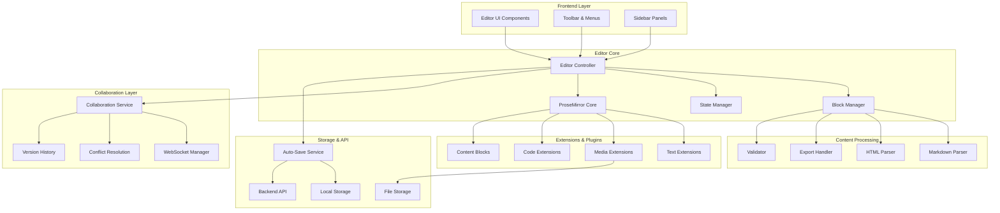

# Advanced Editor System Design

## Overview

The Advanced Editor System transforms the existing basic blog editor into a modern, block-based rich text editing environment. The system adopts a modular architecture built on proven technologies like ProseMirror and Tiptap, providing a Notion-style editing experience with comprehensive formatting, collaboration, and content management capabilities.

The design emphasizes extensibility, performance, and accessibility while maintaining backward compatibility with existing content. The system supports dual-mode editing (WYSIWYG and Markdown), real-time collaboration, and advanced content features through a plugin-based architecture.

## Architecture

### High-Level Architecture



### Technology Stack

**Core Editor Framework:**
- **ProseMirror**: Low-level editor foundation providing schema enforcement and state management
- **Tiptap**: High-level wrapper around ProseMirror with React integration and extension system
- **BlockNote**: Block-based editor components for Notion-style editing experience

**Frontend Technologies:**
- **React 18+**: Component framework with concurrent features
- **TypeScript**: Type safety and developer experience
- **Tailwind CSS**: Utility-first styling framework
- **Framer Motion**: Animation and interaction library

**Collaboration & Real-time:**
- **WebSockets**: Real-time communication protocol
- **Y.js (CRDT)**: Conflict-free replicated data types for collaborative editing
- **Liveblocks**: Managed collaboration infrastructure (alternative to custom implementation)

**Content Processing:**
- **Unified.js**: Markdown parsing and processing ecosystem
- **Rehype/Remark**: HTML and Markdown transformation plugins
- **Prism.js**: Syntax highlighting for code blocks

## Components and Interfaces

### Core Editor Components

#### EditorController
```typescript
interface EditorController {
  // Core editor management
  initialize(config: EditorConfig): Promise<void>
  destroy(): void
  
  // Content operations
  getContent(): EditorContent
  setContent(content: EditorContent): void
  insertBlock(type: BlockType, position?: number): Block
  deleteBlock(blockId: string): void
  
  // Mode switching
  switchMode(mode: 'wysiwyg' | 'markdown'): void
  getCurrentMode(): EditorMode
  
  // Collaboration
  enableCollaboration(config: CollaborationConfig): void
  disableCollaboration(): void
  
  // Events
  on(event: EditorEvent, callback: EventCallback): void
  off(event: EditorEvent, callback: EventCallback): void
}
```

#### BlockManager
```typescript
interface BlockManager {
  // Block operations
  createBlock(type: BlockType, content?: any): Block
  updateBlock(blockId: string, updates: Partial<Block>): void
  moveBlock(blockId: string, newPosition: number): void
  duplicateBlock(blockId: string): Block
  
  // Block queries
  getBlock(blockId: string): Block | null
  getAllBlocks(): Block[]
  getBlocksByType(type: BlockType): Block[]
  
  // Block validation
  validateBlock(block: Block): ValidationResult
  canInsertBlock(type: BlockType, position: number): boolean
}
```

#### ContentProcessor
```typescript
interface ContentProcessor {
  // Format conversion
  htmlToBlocks(html: string): Block[]
  blocksToHtml(blocks: Block[]): string
  markdownToBlocks(markdown: string): Block[]
  blocksToMarkdown(blocks: Block[]): string
  
  // Export formats
  exportToPdf(blocks: Block[], options: PdfOptions): Promise<Blob>
  exportToJson(blocks: Block[]): string
  
  // Content migration
  migrateContent(legacyContent: string, format: ContentFormat): Block[]
  validateMigration(original: string, migrated: Block[]): MigrationResult
}
```

### Block System Architecture

#### Block Interface
```typescript
interface Block {
  id: string
  type: BlockType
  content: BlockContent
  properties: BlockProperties
  children?: Block[]
  metadata: BlockMetadata
}

interface BlockContent {
  text?: string
  html?: string
  data?: Record<string, any>
}

interface BlockProperties {
  alignment?: 'left' | 'center' | 'right' | 'justify'
  color?: string
  backgroundColor?: string
  fontSize?: number
  fontFamily?: string
  indentation?: number
  [key: string]: any
}

interface BlockMetadata {
  createdAt: Date
  updatedAt: Date
  author?: string
  version: number
}
```

#### Block Types
```typescript
enum BlockType {
  // Text blocks
  PARAGRAPH = 'paragraph',
  HEADING = 'heading',
  QUOTE = 'quote',
  LIST_ITEM = 'listItem',
  
  // Media blocks
  IMAGE = 'image',
  VIDEO = 'video',
  AUDIO = 'audio',
  FILE = 'file',
  
  // Code blocks
  CODE_BLOCK = 'codeBlock',
  INLINE_CODE = 'inlineCode',
  
  // Layout blocks
  COLUMNS = 'columns',
  DIVIDER = 'divider',
  SPACER = 'spacer',
  
  // Interactive blocks
  CALLOUT = 'callout',
  TABLE = 'table',
  EMBED = 'embed',
  
  // Template blocks
  TEMPLATE = 'template'
}
```

### Extension System

#### Extension Interface
```typescript
interface Extension {
  name: string
  version: string
  dependencies?: string[]
  
  // Lifecycle hooks
  onCreate?(editor: EditorController): void
  onDestroy?(editor: EditorController): void
  
  // Block definitions
  blocks?: BlockDefinition[]
  
  // Commands
  commands?: Record<string, Command>
  
  // Keyboard shortcuts
  keymap?: Record<string, Command>
  
  // UI components
  toolbarItems?: ToolbarItem[]
  menuItems?: MenuItem[]
}

interface BlockDefinition {
  type: BlockType
  schema: BlockSchema
  component: React.ComponentType<BlockProps>
  toolbar?: ToolbarConfig
  properties?: PropertyDefinition[]
}
```

### Collaboration System

#### CollaborationEngine
```typescript
interface CollaborationEngine {
  // Session management
  startSession(documentId: string): Promise<CollaborationSession>
  endSession(): void
  
  // User presence
  updatePresence(presence: UserPresence): void
  getActiveUsers(): UserPresence[]
  
  // Comments and suggestions
  addComment(blockId: string, comment: Comment): Promise<Comment>
  addSuggestion(blockId: string, suggestion: Suggestion): Promise<Suggestion>
  resolveComment(commentId: string): Promise<void>
  
  // Version control
  createVersion(description?: string): Promise<Version>
  restoreVersion(versionId: string): Promise<void>
  getVersionHistory(): Promise<Version[]>
  
  // Conflict resolution
  resolveConflict(conflict: Conflict): Promise<Resolution>
}
```

#### Real-time Synchronization
```typescript
interface SyncManager {
  // Operation handling
  applyOperation(operation: Operation): void
  broadcastOperation(operation: Operation): void
  
  // State synchronization
  syncState(): Promise<void>
  handleRemoteChange(change: RemoteChange): void
  
  // Conflict detection
  detectConflicts(operations: Operation[]): Conflict[]
  mergeOperations(operations: Operation[]): Operation[]
}
```

## Data Models

### Document Structure
```typescript
interface Document {
  id: string
  title: string
  blocks: Block[]
  metadata: DocumentMetadata
  collaborators: Collaborator[]
  versions: Version[]
  settings: DocumentSettings
}

interface DocumentMetadata {
  createdAt: Date
  updatedAt: Date
  author: string
  tags: string[]
  category?: string
  status: 'draft' | 'published' | 'archived'
  seoData: SEOData
}

interface DocumentSettings {
  allowComments: boolean
  allowSuggestions: boolean
  publicEdit: boolean
  template?: string
  theme?: string
}
```

### Media Management
```typescript
interface MediaItem {
  id: string
  filename: string
  originalName: string
  mimeType: string
  size: number
  url: string
  thumbnailUrl?: string
  metadata: MediaMetadata
  uploadedAt: Date
  uploadedBy: string
}

interface MediaMetadata {
  width?: number
  height?: number
  duration?: number
  altText?: string
  caption?: string
  credits?: string
}
```

### Template System
```typescript
interface Template {
  id: string
  name: string
  description: string
  category: string
  blocks: Block[]
  variables: TemplateVariable[]
  preview: string
  createdAt: Date
  updatedBy: string
}

interface TemplateVariable {
  name: string
  type: 'text' | 'image' | 'date' | 'number'
  defaultValue?: any
  required: boolean
  description?: string
}
```

### User and Collaboration Models
```typescript
interface User {
  id: string
  name: string
  email: string
  avatar?: string
  role: 'admin' | 'editor' | 'viewer'
  permissions: Permission[]
}

interface Collaborator extends User {
  joinedAt: Date
  lastActive: Date
  presence: UserPresence
}

interface UserPresence {
  userId: string
  cursor?: CursorPosition
  selection?: SelectionRange
  color: string
  isActive: boolean
}

interface Comment {
  id: string
  blockId: string
  author: User
  content: string
  createdAt: Date
  resolved: boolean
  replies: Comment[]
}

interface Suggestion {
  id: string
  blockId: string
  author: User
  type: 'insert' | 'delete' | 'modify'
  originalContent: any
  suggestedContent: any
  status: 'pending' | 'accepted' | 'rejected'
  createdAt: Date
}
```

Now I need to use the prework tool to analyze the acceptance criteria before writing the Correctness Properties section.

<function_calls>
<invoke name="prework">
<parameter name="featureName">advanced-editor-system

## Correctness Properties

*A property is a characteristic or behavior that should hold true across all valid executions of a system—essentially, a formal statement about what the system should do. Properties serve as the bridge between human-readable specifications and machine-verifiable correctness guarantees.*

Based on the prework analysis, the following properties have been identified to validate the system's correctness across all acceptance criteria:

### Property 1: Text Formatting Consistency
*For any* text selection and formatting operation (bold, italic, strikethrough, underline, superscript, subscript, color, highlighting), applying the formatting should result in the text having the specified formatting attributes in both the editor display and the underlying data model.
**Validates: Requirements 1.1, 3.1, 3.2, 3.5**

### Property 2: Block Creation and Styling
*For any* block type (paragraph, heading, blockquote, table, list, callout, columns, divider), creating a block should result in a properly structured block with the correct default styling and formatting options available.
**Validates: Requirements 1.3, 1.4, 1.5, 6.1, 6.2, 6.3**

### Property 3: Dual-Mode Round-Trip Preservation
*For any* valid content, converting from WYSIWYG to Markdown and back to WYSIWYG should preserve all formatting elements and content structure without loss.
**Validates: Requirements 2.1, 2.2, 2.4**

### Property 4: Mode Synchronization
*For any* content modification in either WYSIWYG or Markdown mode, the change should be immediately reflected in the other mode with consistent formatting representation.
**Validates: Requirements 2.3**

### Property 5: Markdown Error Handling
*For any* invalid Markdown syntax, the system should provide clear error indicators and helpful suggestions without corrupting existing content.
**Validates: Requirements 2.5**

### Property 6: Typography Control Application
*For any* text selection, applying typography controls (font family, alignment, line spacing) should result in the text displaying with the specified typography properties.
**Validates: Requirements 3.3, 3.4**

### Property 7: Media Upload and Insertion
*For any* supported media type (image, video, audio, file) and upload method (drag-drop, file selection, URL import), the media should be successfully inserted with proper responsive HTML and accessibility attributes.
**Validates: Requirements 4.1, 4.2, 4.3, 4.4, 4.6**

### Property 8: Image Editing Operations
*For any* image and editing operation (crop, resize, filter), applying the operation should modify the image correctly while preserving the original file and maintaining proper references.
**Validates: Requirements 4.5**

### Property 9: Code Block Functionality
*For any* programming language and code content, creating a code block should provide syntax highlighting, line numbers, proper indentation, and copy functionality.
**Validates: Requirements 5.1, 5.2, 5.3, 5.5**

### Property 10: Inline Code Formatting
*For any* text marked as inline code, it should display with monospace font and background highlighting while maintaining readability.
**Validates: Requirements 5.4**

### Property 11: Block Manipulation Operations
*For any* content block and manipulation operation (drag-drop reordering, duplication, deletion), the operation should complete successfully while maintaining document structure and block relationships.
**Validates: Requirements 6.4, 6.5**

### Property 12: Collaboration Feature Integrity
*For any* collaborative action (comment addition, suggestion creation, version creation), the action should be properly tracked, attributed to the correct user, and maintain referential integrity with the content.
**Validates: Requirements 7.1, 7.2, 7.3**

### Property 13: Real-Time Collaboration Consistency
*For any* concurrent editing session, all participants should see consistent content state with proper conflict resolution and user presence indicators.
**Validates: Requirements 7.4, 7.5**

### Property 14: SEO Analysis Accuracy
*For any* content modification, the SEO analyzer should provide accurate real-time feedback including readability scores, meta description validation, heading structure analysis, and keyword suggestions.
**Validates: Requirements 8.1, 8.2, 8.3, 8.4, 8.5**

### Property 15: Accessibility Compliance
*For any* user interaction method (keyboard navigation, screen reader), all editor functionality should be accessible with proper ARIA labels, focus indicators, and color contrast validation.
**Validates: Requirements 9.1, 9.2, 9.3, 9.4, 9.5**

### Property 16: Auto-Save and Performance
*For any* content modification, the system should auto-save within the specified interval, maintain local backups, implement lazy loading for large documents, and continue functioning offline.
**Validates: Requirements 10.1, 10.2, 10.3, 10.4, 10.5**

### Property 17: Export Format Integrity
*For any* export format (HTML, Markdown, PDF, JSON), the exported content should maintain all formatting, structure, and metadata while conforming to the target format's standards.
**Validates: Requirements 11.1, 11.2, 11.3, 11.4, 11.5**

### Property 18: Template System Functionality
*For any* template operation (creation, application, modification, search), the system should handle templates correctly with proper placeholder population and update propagation.
**Validates: Requirements 12.1, 12.2, 12.3, 12.4, 12.5**

### Property 19: Content Migration Preservation
*For any* existing content format, migration to the new block-based system should preserve all content, metadata, and formatting while providing compatibility mode for unsupported elements.
**Validates: Requirements 13.1, 13.2, 13.3, 13.4, 13.5**

### Property 20: Content Validation Completeness
*For any* content prepared for publication, the validation system should check all links, images, formatting, and custom rules, providing specific error messages and suggested fixes when issues are found.
**Validates: Requirements 14.1, 14.2, 14.3, 14.4, 14.5**

## Error Handling

### Error Categories and Strategies

**Content Processing Errors:**
- **Parsing Failures**: When content cannot be parsed (invalid HTML/Markdown), preserve original content and provide error details
- **Format Conversion Errors**: When conversion between formats fails, maintain current state and offer manual correction options
- **Migration Errors**: When legacy content cannot be migrated, preserve in compatibility mode with clear indicators

**Collaboration Errors:**
- **Sync Conflicts**: Use CRDT-based conflict resolution to automatically merge changes when possible
- **Network Failures**: Maintain local state and queue operations for retry when connection is restored
- **Permission Errors**: Gracefully handle permission changes with clear user feedback

**Media and File Errors:**
- **Upload Failures**: Provide retry mechanisms and clear error messages for file size, format, or network issues
- **Processing Errors**: When image editing or media processing fails, preserve original and offer alternative options
- **Storage Errors**: Implement fallback storage options and clear user notification

**Performance and Resource Errors:**
- **Memory Limits**: Implement progressive loading and content virtualization for large documents
- **Timeout Errors**: Provide user feedback and retry options for long-running operations
- **Browser Compatibility**: Graceful degradation for unsupported features with alternative implementations

### Error Recovery Mechanisms

```typescript
interface ErrorHandler {
  // Error classification
  classifyError(error: Error): ErrorCategory
  
  // Recovery strategies
  attemptRecovery(error: Error): Promise<RecoveryResult>
  
  // User notification
  notifyUser(error: Error, context: ErrorContext): void
  
  // Fallback options
  provideFallback(operation: FailedOperation): AlternativeAction[]
}

interface RecoveryResult {
  success: boolean
  recoveredData?: any
  alternativeActions?: AlternativeAction[]
  userMessage: string
}
```

## Testing Strategy

### Dual Testing Approach

The Advanced Editor System requires comprehensive testing using both unit tests and property-based tests to ensure correctness across all functionality:

**Unit Testing Focus:**
- Specific user interaction scenarios and edge cases
- Integration points between editor components
- Error conditions and recovery mechanisms
- Browser compatibility and accessibility features
- Performance benchmarks for critical operations

**Property-Based Testing Focus:**
- Universal properties that must hold for all inputs
- Content format conversion and preservation
- Collaborative editing consistency
- Block manipulation operations
- Export format integrity

### Property-Based Testing Configuration

**Testing Framework**: Fast-check (JavaScript/TypeScript property-based testing library)

**Test Configuration:**
- Minimum 100 iterations per property test to ensure comprehensive input coverage
- Custom generators for editor-specific data types (blocks, content, formatting)
- Shrinking strategies to find minimal failing examples
- Timeout configuration for long-running collaborative tests

**Property Test Implementation Requirements:**
- Each correctness property must be implemented as a single property-based test
- Tests must be tagged with feature name and property reference
- Tag format: **Feature: advanced-editor-system, Property {number}: {property_text}**
- All property tests must reference their corresponding design document property

**Example Property Test Structure:**
```typescript
// Feature: advanced-editor-system, Property 3: Dual-Mode Round-Trip Preservation
fc.test('WYSIWYG to Markdown round-trip preserves content', 
  fc.record({
    blocks: fc.array(blockGenerator),
    formatting: fc.array(formattingGenerator)
  }), 
  (data) => {
    const wysiwyg = createWYSIWYGContent(data.blocks, data.formatting);
    const markdown = convertToMarkdown(wysiwyg);
    const roundTrip = convertToWYSIWYG(markdown);
    
    expect(roundTrip).toEqual(wysiwyg);
  }
);
```

### Testing Data Generators

**Content Generators:**
- Block generators for all supported block types
- Text content with various formatting combinations
- Media content with different file types and sizes
- Template structures with variable complexity

**User Interaction Generators:**
- Keyboard input sequences
- Mouse interaction patterns
- Touch gesture combinations
- Collaborative editing scenarios

**Edge Case Coverage:**
- Empty content and boundary conditions
- Maximum size limits and performance stress tests
- Invalid input handling and error conditions
- Browser compatibility edge cases

### Integration Testing Strategy

**Component Integration:**
- Editor core with extension system
- Collaboration engine with real-time sync
- Media manager with file storage
- Export system with format converters

**End-to-End Scenarios:**
- Complete document creation and editing workflows
- Multi-user collaborative editing sessions
- Content migration from legacy formats
- Export and import round-trip testing

**Performance Testing:**
- Large document handling (1000+ blocks)
- Concurrent user limits (100+ simultaneous editors)
- Media processing performance benchmarks
- Network latency impact on collaboration

### Accessibility Testing

**Automated Testing:**
- ARIA attribute validation
- Color contrast ratio verification
- Keyboard navigation path testing
- Screen reader compatibility checks

**Manual Testing:**
- Real screen reader testing with NVDA, JAWS, VoiceOver
- Keyboard-only navigation verification
- High contrast mode compatibility
- Voice control software compatibility

This comprehensive testing strategy ensures the Advanced Editor System meets all requirements while maintaining high quality, performance, and accessibility standards across all supported platforms and use cases.