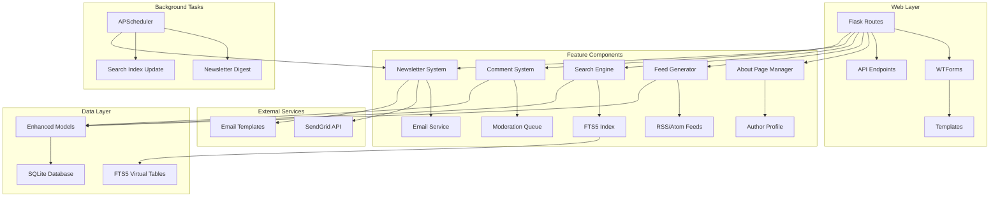

# Design Document: Blog Comprehensive Features

## Overview

This design implements five high-priority features for the Smileys Blog website: About Page & Author Profile, RSS/Atom Feed generation, Enhanced Search Functionality, Newsletter/Email Subscription system, and Comments System. The solution builds upon the existing Flask + SQLAlchemy architecture while maintaining the clean, minimalist design aesthetic and ensuring optimal user experience, SEO benefits, and community engagement.

The design leverages proven libraries and patterns: python-feedgen for RSS/Atom feeds, SQLite FTS5 for full-text search, SendGrid for email delivery, and a custom moderation system for comments. All features integrate seamlessly with the existing enhanced content management system.

## Architecture

### High-Level Architecture



### Component Integration

The enhanced system extends the existing MVC pattern with:
- **Feed Generation**: Automated RSS/Atom feed creation using python-feedgen
- **Search System**: SQLite FTS5 integration for full-text search with autocomplete
- **Email Integration**: SendGrid API for newsletter delivery and notifications
- **Comment Moderation**: Built-in approval workflow with spam protection
- **SEO Enhancement**: Meta tags, sitemaps, and structured data generation

## Components and Interfaces

### Enhanced Data Models

#### Author Profile Model (New)
```python
class AuthorProfile(db.Model):
    id = db.Column(db.Integer, primary_key=True)
    name = db.Column(db.String(100), nullable=False)
    bio = db.Column(db.Text, nullable=False)
    mission_statement = db.Column(db.Text, nullable=False)
    expertise_areas = db.Column(db.Text, nullable=False)  # JSON array
    profile_image = db.Column(db.String(255), nullable=True)
    email = db.Column(db.String(120), nullable=False)
    twitter_handle = db.Column(db.String(50), nullable=True)
    linkedin_url = db.Column(db.String(255), nullable=True)
    github_url = db.Column(db.String(255), nullable=True)
    website_url = db.Column(db.String(255), nullable=True)
    created_at = db.Column(db.DateTime, default=datetime.utcnow)
    updated_at = db.Column(db.DateTime, default=datetime.utcnow, onupdate=datetime.utcnow)
```

#### Newsletter Subscription Model (New)
```python
class NewsletterSubscription(db.Model):
    id = db.Column(db.Integer, primary_key=True)
    email = db.Column(db.String(120), unique=True, nullable=False)
    is_confirmed = db.Column(db.Boolean, default=False)
    confirmation_token = db.Column(db.String(100), unique=True, nullable=True)
    frequency = db.Column(db.String(20), default='weekly')  # weekly, biweekly, monthly
    subscribed_at = db.Column(db.DateTime, default=datetime.utcnow)
    confirmed_at = db.Column(db.DateTime, nullable=True)
    last_email_sent = db.Column(db.DateTime, nullable=True)
    is_active = db.Column(db.Boolean, default=True)
    unsubscribe_token = db.Column(db.String(100), unique=True, nullable=False)
```

#### Comment Model (New)
```python
class Comment(db.Model):
    id = db.Column(db.Integer, primary_key=True)
    post_id = db.Column(db.Integer, db.ForeignKey('post.id'), nullable=False)
    author_name = db.Column(db.String(100), nullable=False)
    author_email = db.Column(db.String(120), nullable=False)
    content = db.Column(db.Text, nullable=False)
    is_approved = db.Column(db.Boolean, default=False)
    is_spam = db.Column(db.Boolean, default=False)
    ip_address = db.Column(db.String(45), nullable=True)
    user_agent = db.Column(db.String(255), nullable=True)
    created_at = db.Column(db.DateTime, default=datetime.utcnow)
    approved_at = db.Column(db.DateTime, nullable=True)
    approved_by = db.Column(db.Integer, db.ForeignKey('user.id'), nullable=True)
    
    # Optional threading support
    parent_id = db.Column(db.Integer, db.ForeignKey('comment.id'), nullable=True)
    replies = db.relationship('Comment', backref=db.backref('parent', remote_side=[id]))
    
    # Relationships
    post = db.relationship('Post', backref='comments')
    moderator = db.relationship('User', backref='moderated_comments')
```

#### Search Analytics Model (New)
```python
class SearchQuery(db.Model):
    id = db.Column(db.Integer, primary_key=True)
    query_text = db.Column(db.String(255), nullable=False)
    results_count = db.Column(db.Integer, nullable=False)
    clicked_result_id = db.Column(db.Integer, db.ForeignKey('post.id'), nullable=True)
    ip_address = db.Column(db.String(45), nullable=True)
    user_agent = db.Column(db.String(255), nullable=True)
    created_at = db.Column(db.DateTime, default=datetime.utcnow)
```

### About Page Management Interface

#### AboutPageManager Class
```python
class AboutPageManager:
    def get_author_profile(self):
        """Get current author profile or create default"""
        
    def update_author_profile(self, **kwargs):
        """Update author profile information"""
        
    def get_social_links(self):
        """Get formatted social media links"""
        
    def upload_profile_image(self, image_file):
        """Handle profile image upload and processing"""
```

### Feed Generation Interface

#### FeedGenerator Class
```python
class FeedGenerator:
    def __init__(self, app):
        """Initialize with Flask app configuration"""
        
    def generate_rss_feed(self, limit=20):
        """Generate RSS 2.0 feed using python-feedgen"""
        
    def generate_atom_feed(self, limit=20):
        """Generate Atom 1.0 feed using python-feedgen"""
        
    def get_feed_items(self, limit=20):
        """Get published posts for feed generation"""
        
    def format_feed_item(self, post):
        """Format post data for feed consumption"""
```

### Search Engine Interface

#### SearchEngine Class
```python
class SearchEngine:
    def __init__(self, app):
        """Initialize FTS5 virtual tables and search configuration"""
        
    def create_search_index(self):
        """Create FTS5 virtual table for full-text search"""
        
    def index_post(self, post):
        """Add or update post in search index"""
        
    def search_posts(self, query, filters=None, page=1, per_page=10):
        """Perform full-text search with filtering and pagination"""
        
    def get_search_suggestions(self, partial_query, limit=5):
        """Generate autocomplete suggestions"""
        
    def log_search_query(self, query, results_count, ip_address=None):
        """Log search analytics"""
        
    def get_popular_searches(self, limit=10):
        """Get most frequent search queries"""
```

### Newsletter System Interface

#### NewsletterManager Class
```python
class NewsletterManager:
    def __init__(self, app, sendgrid_api_key):
        """Initialize with SendGrid configuration"""
        
    def subscribe_email(self, email, frequency='weekly'):
        """Add new subscription with confirmation email"""
        
    def confirm_subscription(self, token):
        """Confirm email subscription using token"""
        
    def unsubscribe_email(self, token):
        """Unsubscribe using unsubscribe token"""
        
    def generate_digest(self, frequency='weekly'):
        """Generate newsletter digest for specified frequency"""
        
    def send_digest_emails(self, frequency='weekly'):
        """Send digest emails to subscribers"""
        
    def create_email_template(self, posts, frequency):
        """Create HTML email template with posts"""
```

### Comment System Interface

#### CommentManager Class
```python
class CommentManager:
    def submit_comment(self, post_id, author_name, author_email, content, ip_address=None):
        """Submit new comment for moderation"""
        
    def approve_comment(self, comment_id, moderator_id):
        """Approve comment and make it public"""
        
    def reject_comment(self, comment_id, moderator_id):
        """Reject comment and mark as spam"""
        
    def get_pending_comments(self):
        """Get comments awaiting moderation"""
        
    def get_approved_comments(self, post_id):
        """Get approved comments for a post"""
        
    def check_spam(self, comment_data):
        """Basic spam detection using simple heuristics"""
        
    def send_notification_email(self, comment):
        """Send email notification to administrators"""
```

### SEO Enhancement Interface

#### SEOManager Class
```python
class SEOManager:
    def generate_meta_tags(self, page_type, content=None):
        """Generate meta tags for different page types"""
        
    def generate_open_graph_tags(self, post=None):
        """Generate Open Graph tags for social sharing"""
        
    def generate_sitemap(self):
        """Generate XML sitemap for all public content"""
        
    def generate_structured_data(self, post=None, page_type='website'):
        """Generate JSON-LD structured data"""
        
    def get_canonical_url(self, endpoint, **values):
        """Generate canonical URLs for pages"""
```

## Data Models

### Database Schema Extensions

The enhanced schema adds new tables while maintaining compatibility:

1. **New Tables**:
   - `author_profile`: Author information and social links
   - `newsletter_subscription`: Email subscriptions with preferences
   - `comment`: Comment system with moderation support
   - `search_query`: Search analytics and popular queries

2. **FTS5 Virtual Table**:
   - `post_search_fts`: Full-text search index for posts
   - Indexes: title, content, summary, category, tag names

3. **Enhanced Existing Tables**:
   - No changes to existing Post, Tag, Image, User models
   - Maintains full backward compatibility

### Search Index Schema

```sql
CREATE VIRTUAL TABLE post_search_fts USING fts5(
    title,
    content,
    summary,
    category,
    tags,
    content_id UNINDEXED
);
```

### Email Template Structure

```python
NEWSLETTER_TEMPLATE = {
    'subject': 'Smileys Blog - {frequency} Digest',
    'html_template': 'newsletter/digest.html',
    'text_template': 'newsletter/digest.txt',
    'variables': ['posts', 'frequency', 'unsubscribe_url', 'author_name']
}
```

## Correctness Properties

*A property is a characteristic or behavior that should hold true across all valid executions of a system—essentially, a formal statement about what the system should do. Properties serve as the bridge between human-readable specifications and machine-verifiable correctness guarantees.*

Now I need to use the prework tool to analyze the acceptance criteria before writing the correctness properties:
### Property 1: Author Information Consistency
*For any* page displaying author information, the author data should be identical between the about page and post author sections.
**Validates: Requirements 1.6**

### Property 2: Published Post Feed Inclusion
*For any* published post, it should automatically appear in both RSS and Atom feeds with all required metadata (title, summary, publication date, author, categories).
**Validates: Requirements 2.3, 2.4**

### Property 3: Feed Content Limitations
*For any* generated feed, it should contain exactly the most recent 20 published posts and exclude all draft or scheduled posts.
**Validates: Requirements 2.5, 2.8**

### Property 4: Feed Discovery Links
*For any* page on the site, it should include RSS and Atom feed discovery links in the HTML head section.
**Validates: Requirements 2.6**

### Property 5: Image Feed References
*For any* post containing images that appears in feeds, the feed entry should include proper image references for all embedded images.
**Validates: Requirements 2.7**

### Property 6: Full-Text Search Coverage
*For any* published post, searching for text from its title, content, summary, or tags should return that post in the search results.
**Validates: Requirements 3.1**

### Property 7: Search Result Completeness
*For any* search result, it should include post title, excerpt, publication date, and matching tags with search terms highlighted.
**Validates: Requirements 3.2, 3.4, 3.7**

### Property 8: Search Autocomplete Functionality
*For any* partial search query, the autocomplete system should return relevant suggestions based on existing content.
**Validates: Requirements 3.3**

### Property 9: Search Filtering Accuracy
*For any* search with filters (date range, category, tags), results should only include posts matching all specified criteria.
**Validates: Requirements 3.5**

### Property 10: Search Pagination
*For any* search returning more than 10 results, the system should provide proper pagination with correct result counts.
**Validates: Requirements 3.8**

### Property 11: Newsletter Subscription Workflow
*For any* email subscription attempt, the system should validate the email, send confirmation, and require double opt-in before activation.
**Validates: Requirements 4.2, 4.3**

### Property 12: Newsletter Digest Generation
*For any* digest frequency setting, the system should compile posts published since the last digest and include titles, summaries, and direct links.
**Validates: Requirements 4.4, 4.6**

### Property 13: Newsletter Unsubscribe Availability
*For any* newsletter email sent, it should include a working unsubscribe link that immediately removes the subscription.
**Validates: Requirements 4.7**

### Property 14: Newsletter Service Integration
*For any* newsletter email, it should be sent through the configured external email service (SendGrid) with proper tracking.
**Validates: Requirements 4.8, 4.9**

### Property 15: Comment Submission Requirements
*For any* comment submission, it should require name, email, and content fields and be held for moderation before public display.
**Validates: Requirements 5.1, 5.2, 5.3**

### Property 16: Comment Moderation Workflow
*For any* submitted comment, it should trigger administrator notification and remain invisible until approved.
**Validates: Requirements 5.4, 5.9**

### Property 17: Comment Display Format
*For any* approved comment, it should display commenter name, date, and content in chronological order below the post.
**Validates: Requirements 5.5, 5.6**

### Property 18: Comment Spam Protection
*For any* comment submission, it should be processed through spam detection filters before entering the moderation queue.
**Validates: Requirements 5.7**

### Property 19: Comment Administrative Actions
*For any* comment in the moderation queue, administrators should be able to approve, reject, or delete it through the dashboard.
**Validates: Requirements 5.8**

### Property 20: Comment Threading Support
*For any* comment reply (if threading is enabled), it should maintain proper parent-child relationships and display hierarchically.
**Validates: Requirements 5.10**

### Property 21: SEO Meta Tag Generation
*For any* page on the site, it should include appropriate meta tags (title, description, keywords) and canonical URLs.
**Validates: Requirements 6.1, 6.5**

### Property 22: Open Graph Tag Inclusion
*For any* post page, it should include complete Open Graph tags for social media sharing with proper metadata.
**Validates: Requirements 6.2**

### Property 23: Structured Data Implementation
*For any* post or author page, it should include valid JSON-LD structured data markup for search engines.
**Validates: Requirements 6.4**

### Property 24: Content Update Synchronization
*For any* content change (new post, updated post), feeds and sitemaps should be automatically updated to reflect the changes.
**Validates: Requirements 6.6**

### Property 25: SEO-Friendly URL Structure
*For any* page or post, the URL should follow SEO-friendly permalink patterns with proper slug generation.
**Validates: Requirements 6.7**

### Property 26: Caching Header Implementation
*For any* static content request, the response should include appropriate cache headers for performance optimization.
**Validates: Requirements 7.1, 7.2**

### Property 27: Content List Pagination
*For any* content list exceeding the page limit, the system should provide proper pagination with navigation controls.
**Validates: Requirements 7.6**

### Property 28: Comment Bulk Operations
*For any* selection of multiple comments, administrators should be able to perform bulk approval or deletion actions.
**Validates: Requirements 8.2**

### Property 29: Analytics Data Collection
*For any* search query or email delivery, the system should collect and store analytics data for reporting purposes.
**Validates: Requirements 8.4, 8.7**

## Error Handling

### Feed Generation Error Handling
- **Invalid Post Data**: Handle posts with missing required fields gracefully
- **XML Generation Failures**: Provide fallback feeds and log generation errors
- **Large Content Issues**: Truncate oversized content appropriately for feeds
- **Image Reference Failures**: Handle broken image links in feed content

### Search System Error Handling
- **FTS5 Index Corruption**: Rebuild search index automatically on corruption detection
- **Query Syntax Errors**: Sanitize and validate search queries before processing
- **Large Result Sets**: Implement proper pagination and result limiting
- **Index Update Failures**: Queue failed updates for retry processing

### Newsletter System Error Handling
- **Email Service Failures**: Implement retry logic with exponential backoff
- **Invalid Email Addresses**: Validate and sanitize email addresses before processing
- **Template Rendering Errors**: Provide fallback templates for digest generation
- **Subscription Token Issues**: Handle expired or invalid confirmation tokens gracefully

### Comment System Error Handling
- **Spam Detection Failures**: Provide manual moderation fallback for detection errors
- **Notification Delivery Issues**: Queue failed notifications for retry
- **Threading Corruption**: Validate parent-child relationships before saving
- **Bulk Operation Failures**: Handle partial failures in bulk comment operations

### SEO and Performance Error Handling
- **Sitemap Generation Failures**: Provide cached sitemap fallback
- **Meta Tag Generation Issues**: Use default meta tags when dynamic generation fails
- **Cache Invalidation Problems**: Implement cache warming and fallback strategies
- **Structured Data Validation**: Validate JSON-LD before output and provide fallbacks

## Testing Strategy

### Dual Testing Approach

The testing strategy employs both unit tests and property-based tests to ensure comprehensive coverage:

**Unit Tests** focus on:
- Specific examples and edge cases for each feature
- Integration points between new and existing components
- Error conditions and boundary cases
- UI component behavior and form validation
- External service integration mocking

**Property-Based Tests** focus on:
- Universal properties across all inputs and content types
- Comprehensive input coverage through randomization
- Correctness properties defined in this design document
- Data integrity and consistency validation across features

### Property-Based Testing Configuration

**Framework Selection**: Use Hypothesis for Python property-based testing
- Minimum 100 iterations per property test
- Each test references its corresponding design document property
- Tag format: **Feature: blog-comprehensive-features, Property {number}: {property_text}**

**Test Categories**:
1. **About Page Properties**: Author information consistency and display
2. **Feed Generation Properties**: RSS/Atom feed creation and content inclusion
3. **Search Properties**: Full-text search, filtering, and pagination
4. **Newsletter Properties**: Subscription workflow and digest generation
5. **Comment Properties**: Submission, moderation, and display workflows
6. **SEO Properties**: Meta tags, structured data, and URL generation
7. **Performance Properties**: Caching, pagination, and optimization

### Integration Testing

**External Service Testing**:
- Mock SendGrid API for newsletter testing
- Test email template generation and delivery
- Verify feed validation against RSS/Atom standards
- Test search index creation and maintenance

**Cross-Feature Testing**:
- Test interaction between comments and newsletter notifications
- Verify search indexing of new posts and comments
- Test feed updates when posts are published or modified
- Verify SEO tag generation across all page types

**Database Integration Testing**:
- Test FTS5 virtual table creation and maintenance
- Verify data migration compatibility with existing content
- Test transaction handling for complex operations
- Verify foreign key relationships and cascading deletes

### Performance Testing

**Search Performance**:
- Test search response times with large content sets
- Verify FTS5 index efficiency and query optimization
- Test autocomplete response times and suggestion quality

**Feed Generation Performance**:
- Test feed generation times with large post collections
- Verify memory usage during XML generation
- Test concurrent feed access and caching effectiveness

**Newsletter Performance**:
- Test digest generation with large subscriber lists
- Verify email template rendering performance
- Test bulk email sending efficiency and rate limiting

**Comment System Performance**:
- Test comment display performance with large comment threads
- Verify moderation queue performance with high comment volumes
- Test spam detection processing times and accuracy