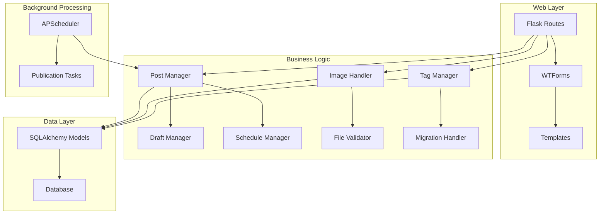

# Design Document: Enhanced Content Management

## Overview

This design enhances the Smileys Blog Flask application with advanced content management capabilities including post scheduling, draft management, image uploads, and proper tag relationships. The solution maintains the existing Flask + SQLAlchemy + WTForms architecture while adding new models, background task processing, and enhanced dashboard functionality.

The design prioritizes backward compatibility, security, and maintainability while providing a seamless user experience that preserves the current design aesthetic.

## Architecture

### High-Level Architecture



### Component Interaction

The enhanced system maintains the existing MVC pattern while adding:
- **Background Scheduler**: APScheduler for automated post publication
- **File Management**: Secure image upload and storage system
- **Enhanced Models**: Extended database schema with proper relationships
- **Migration System**: Flask-Migrate for schema evolution

## Components and Interfaces

### Enhanced Data Models

#### Post Model (Extended)
```python
class Post(db.Model):
    id = db.Column(db.Integer, primary_key=True)
    title = db.Column(db.String(200), nullable=False)
    content = db.Column(db.Text, nullable=False)
    summary = db.Column(db.Text)  # New: Manual or auto-generated excerpt
    category = db.Column(db.String(50), nullable=False)
    status = db.Column(db.String(20), default='draft')  # New: draft, published, scheduled
    created_at = db.Column(db.DateTime, default=datetime.utcnow)
    published_at = db.Column(db.DateTime)  # New: Actual publication time
    scheduled_publish_at = db.Column(db.DateTime)  # New: Scheduled publication time
    author_id = db.Column(db.Integer, db.ForeignKey('user.id'), nullable=False)
    
    # Relationships
    tags = db.relationship('Tag', secondary='post_tags', backref='posts')
    images = db.relationship('Image', backref='post', cascade='all, delete-orphan')
```

#### Tag Model (New)
```python
class Tag(db.Model):
    id = db.Column(db.Integer, primary_key=True)
    name = db.Column(db.String(50), unique=True, nullable=False)
    slug = db.Column(db.String(50), unique=True, nullable=False)
    created_at = db.Column(db.DateTime, default=datetime.utcnow)
```

#### PostTag Association (New)
```python
post_tags = db.Table('post_tags',
    db.Column('post_id', db.Integer, db.ForeignKey('post.id'), primary_key=True),
    db.Column('tag_id', db.Integer, db.ForeignKey('tag.id'), primary_key=True)
)
```

#### Image Model (New)
```python
class Image(db.Model):
    id = db.Column(db.Integer, primary_key=True)
    filename = db.Column(db.String(255), nullable=False)
    original_name = db.Column(db.String(255), nullable=False)
    file_size = db.Column(db.Integer, nullable=False)
    mime_type = db.Column(db.String(50), nullable=False)
    upload_date = db.Column(db.DateTime, default=datetime.utcnow)
    post_id = db.Column(db.Integer, db.ForeignKey('post.id'))
```

### Post Management Interface

#### PostManager Class
```python
class PostManager:
    def create_post(self, title, content, summary=None, status='draft', 
                   scheduled_time=None, tags=None):
        """Create new post with status and scheduling support"""
        
    def update_post(self, post_id, **kwargs):
        """Update existing post while preserving relationships"""
        
    def publish_post(self, post_id):
        """Immediately publish a draft or scheduled post"""
        
    def schedule_post(self, post_id, publish_time):
        """Schedule post for future publication"""
        
    def generate_summary(self, content, max_length=150):
        """Auto-generate post summary from content"""
```

### Image Upload Interface

#### ImageHandler Class
```python
class ImageHandler:
    ALLOWED_EXTENSIONS = {'jpg', 'jpeg', 'png', 'gif'}
    MAX_FILE_SIZE = 5 * 1024 * 1024  # 5MB
    
    def validate_image(self, file):
        """Validate file type, size, and content"""
        
    def save_image(self, file, post_id=None):
        """Securely save uploaded image with unique filename"""
        
    def generate_filename(self, original_filename):
        """Generate secure, unique filename"""
        
    def get_image_url(self, filename):
        """Generate URL for serving uploaded images"""
```

### Tag Management Interface

#### TagManager Class
```python
class TagManager:
    def migrate_legacy_tags(self):
        """Convert comma-separated tag strings to relationships"""
        
    def get_or_create_tag(self, tag_name):
        """Get existing tag or create new one"""
        
    def associate_tags(self, post_id, tag_names):
        """Create post-tag associations"""
        
    def get_popular_tags(self, limit=20):
        """Get most frequently used tags"""
```

### Background Task Interface

#### ScheduleManager Class
```python
class ScheduleManager:
    def __init__(self, app):
        """Initialize APScheduler with Flask app"""
        
    def check_scheduled_posts(self):
        """Background task to publish scheduled posts"""
        
    def schedule_publication_check(self):
        """Set up recurring task for checking publications"""
        
    def publish_scheduled_post(self, post_id):
        """Publish a specific scheduled post"""
```

## Data Models

### Database Schema Changes

The enhanced schema maintains backward compatibility while adding new functionality:

1. **Post Table Extensions**:
   - `summary` (TEXT): Manual or auto-generated excerpt
   - `status` (VARCHAR(20)): 'draft', 'published', 'scheduled'
   - `published_at` (DATETIME): Actual publication timestamp
   - `scheduled_publish_at` (DATETIME): Scheduled publication time

2. **New Tables**:
   - `tag`: Proper tag entities with id, name, slug
   - `post_tags`: Many-to-many association table
   - `image`: Uploaded image metadata and references

3. **Migration Strategy**:
   - Use Flask-Migrate/Alembic for schema evolution
   - Preserve existing data during tag migration
   - Maintain existing category functionality

### Data Migration Process

```python
def migrate_tags_to_relationships():
    """Migration function to convert string tags to relationships"""
    posts_with_tags = Post.query.filter(Post.tags.isnot(None)).all()
    
    for post in posts_with_tags:
        if post.tags:  # Legacy string tags
            tag_names = [tag.strip() for tag in post.tags.split(',')]
            for tag_name in tag_names:
                tag = Tag.query.filter_by(name=tag_name).first()
                if not tag:
                    tag = Tag(name=tag_name, slug=slugify(tag_name))
                    db.session.add(tag)
                post.tag_relationships.append(tag)
    
    db.session.commit()
```

## Correctness Properties

*A property is a characteristic or behavior that should hold true across all valid executions of a system—essentially, a formal statement about what the system should do. Properties serve as the bridge between human-readable specifications and machine-verifiable correctness guarantees.*

### Property 1: Scheduled Post Automatic Publication
*For any* post with a scheduled publication time that has passed, the system should automatically update the post status to published and make it publicly accessible.
**Validates: Requirements 1.2, 1.5, 7.2**

### Property 2: Draft Post Visibility
*For any* post with draft status, the post should not appear in public queries or be accessible to non-authenticated users.
**Validates: Requirements 1.3**

### Property 3: Post Status Organization
*For any* collection of posts with mixed statuses, the dashboard should correctly group and display them by their respective status categories (draft, published, scheduled).
**Validates: Requirements 1.4, 6.1, 6.2, 6.4**

### Property 4: Schedule Preservation During Editing
*For any* scheduled post that is edited without explicitly changing the publication time, the scheduled_publish_at field should remain unchanged.
**Validates: Requirements 1.6**

### Property 5: Summary Generation and Formatting
*For any* post content, if no manual summary is provided, the system should generate an excerpt from the first 150 characters, truncate summaries exceeding 200 characters with ellipsis, and preserve basic formatting.
**Validates: Requirements 2.2, 2.4, 2.5**

### Property 6: Homepage Summary Display
*For any* post displayed on the homepage, the system should show the summary field instead of the full content.
**Validates: Requirements 2.3**

### Property 7: Image Upload Validation
*For any* uploaded file, the system should validate file type (accepting only JPEG, PNG, GIF), reject files exceeding 5MB, and generate unique secure filenames for accepted uploads.
**Validates: Requirements 3.2, 3.3, 3.4**

### Property 8: Image Reference Integration
*For any* successfully uploaded image, the system should insert the appropriate image reference into the post content and serve the image with proper caching headers.
**Validates: Requirements 3.5, 3.6**

### Property 9: Tag Migration Consistency
*For any* existing post with comma-separated tag strings, the migration process should create equivalent tag relationships without data loss.
**Validates: Requirements 4.1**

### Property 10: Tag Creation and Association
*For any* new tag name, the system should create a unique database entity and properly establish many-to-many relationships with associated posts.
**Validates: Requirements 4.3, 4.4**

### Property 11: Tag Filtering Accuracy
*For any* tag selection, the system should return exactly the posts that are associated with that tag through the relationship table.
**Validates: Requirements 4.6**

### Property 12: Data Migration Preservation
*For any* existing post data during system upgrade, all current content, metadata, and category information should be preserved without modification.
**Validates: Requirements 5.5, 5.6**

### Property 13: Timezone Handling Consistency
*For any* scheduled post with timezone information, the publication system should correctly handle timezone conversions and publish at the intended local time.
**Validates: Requirements 7.3**

### Property 14: Publication Event Logging
*For any* automatic post publication event, the system should create a corresponding log entry with timestamp and post details.
**Validates: Requirements 7.4**

### Property 15: Publication Retry Mechanism
*For any* failed publication attempt, the system should retry the operation and log both the failure and retry attempts.
**Validates: Requirements 7.5**

## Error Handling

### File Upload Error Handling
- **Invalid File Types**: Return clear error messages for unsupported formats
- **File Size Violations**: Provide specific feedback about size limits
- **Storage Failures**: Handle disk space and permission issues gracefully
- **Malicious Files**: Implement content-based validation beyond extension checking

### Scheduling Error Handling
- **Past Dates**: Prevent scheduling posts for past timestamps
- **Invalid Timezones**: Validate and normalize timezone information
- **Concurrent Modifications**: Handle race conditions during publication
- **System Downtime**: Ensure scheduled posts are published when system recovers

### Database Migration Error Handling
- **Constraint Violations**: Handle duplicate tags and relationship conflicts
- **Data Corruption**: Validate data integrity during migration
- **Rollback Capability**: Provide migration rollback for failed upgrades
- **Partial Failures**: Handle incomplete migrations gracefully

### Tag Management Error Handling
- **Duplicate Tags**: Merge or prevent duplicate tag creation
- **Invalid Characters**: Sanitize tag names and generate valid slugs
- **Orphaned Relationships**: Clean up broken post-tag associations
- **Bulk Operations**: Handle failures in batch tag operations

## Testing Strategy

### Dual Testing Approach

The testing strategy employs both unit tests and property-based tests to ensure comprehensive coverage:

**Unit Tests** focus on:
- Specific examples and edge cases
- Integration points between components  
- Error conditions and boundary cases
- UI component behavior and form validation

**Property-Based Tests** focus on:
- Universal properties across all inputs
- Comprehensive input coverage through randomization
- Correctness properties defined in this design document
- Data integrity and consistency validation

### Property-Based Testing Configuration

**Framework Selection**: Use Hypothesis for Python property-based testing
- Minimum 100 iterations per property test
- Each test references its corresponding design document property
- Tag format: **Feature: enhanced-content-management, Property {number}: {property_text}**

**Test Categories**:
1. **Post Management Properties**: Scheduling, status transitions, draft handling
2. **Content Properties**: Summary generation, formatting preservation
3. **File Upload Properties**: Validation, storage, security
4. **Tag Properties**: Migration, relationships, filtering
5. **System Properties**: Data preservation, logging, error recovery

### Integration Testing

**Database Migration Testing**:
- Test migration scripts with various legacy data scenarios
- Verify data integrity before and after migrations
- Test rollback procedures for failed migrations

**Background Task Testing**:
- Mock time advancement for scheduled publication testing
- Test scheduler behavior under various system conditions
- Verify task queue reliability and error recovery

**File System Testing**:
- Test image upload with various file types and sizes
- Verify secure file storage and access permissions
- Test cleanup procedures for orphaned files

### Performance Testing

**Upload Performance**:
- Test concurrent image uploads
- Verify memory usage during large file processing
- Test storage capacity limits

**Scheduling Performance**:
- Test system behavior with large numbers of scheduled posts
- Verify scheduler efficiency and resource usage
- Test publication accuracy under high load