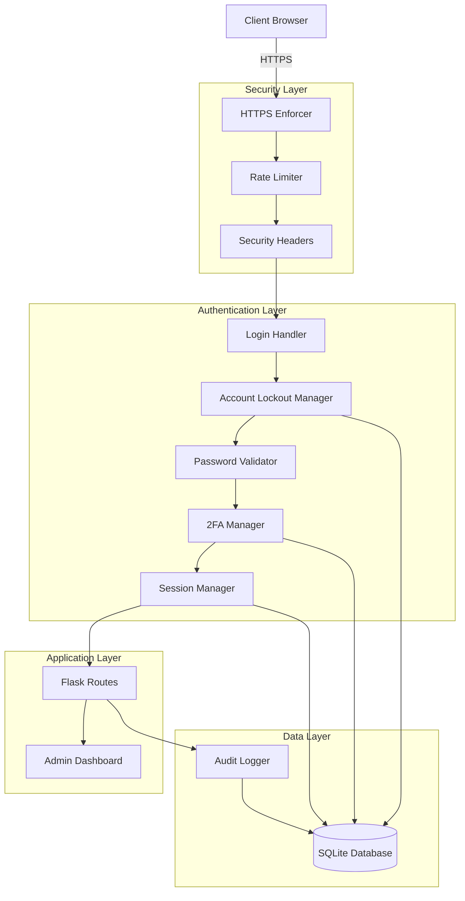

# Design Document: Security Hardening

## Overview

This design document outlines the architecture and implementation approach for adding comprehensive security enhancements to the Flask blog application. The solution integrates multiple security layers including rate limiting, account lockout, two-factor authentication, session management, password complexity enforcement, security headers, HTTPS enforcement, and audit logging.

The design follows a modular approach where each security feature is implemented as a separate component that can be independently configured and tested. All components integrate seamlessly with the existing Flask-Login authentication system while maintaining backward compatibility.

## Architecture

### High-Level Architecture



### Component Interaction Flow

**Login Flow with Security Features:**

1. Client sends login request
2. HTTPS Enforcer redirects HTTP to HTTPS (production only)
3. Rate Limiter checks request count for IP address
4. Security Headers are added to response
5. Account Lockout Manager checks if account is locked
6. Password Validator verifies password complexity (on registration/password change)
7. Login Handler authenticates credentials
8. Two-Factor Auth Manager prompts for TOTP code (if enabled)
9. Session Manager creates session with timeout
10. Audit Logger records login attempt
11. User is granted access

## Components and Interfaces

### 1. Rate Limiter Component

**Purpose:** Prevent brute force attacks by limiting request rates per IP address.

**Implementation:** Uses Flask-Limiter library with Redis or in-memory storage backend.

**Interface:**
```python
class RateLimiterConfig:
    """Configuration for rate limiting"""
    
    def __init__(self):
        self.login_limit: str = "5 per minute"
        self.admin_limit: str = "10 per minute"
        self.password_reset_limit: str = "3 per hour"
        self.storage_uri: str = "memory://"  # or redis://
    
    @classmethod
    def from_env(cls) -> 'RateLimiterConfig':
        """Load configuration from environment variables"""
        pass

def init_rate_limiter(app: Flask, config: RateLimiterConfig) -> Limiter:
    """Initialize rate limiter with Flask app"""
    pass

# Decorator usage
@limiter.limit("5 per minute")
def login():
    pass
```

**Key Methods:**
- `init_rate_limiter(app, config)`: Initialize limiter with Flask app
- `@limiter.limit(limit_string)`: Decorator to apply rate limits to routes
- `limiter.exempt(route)`: Exempt specific routes from rate limiting

### 2. Account Lockout Manager

**Purpose:** Lock accounts after repeated failed login attempts to prevent credential stuffing.

**Interface:**
```python
class AccountLockoutManager:
    """Manages account lockout after failed login attempts"""
    
    def __init__(self, db: SQLAlchemy, config: LockoutConfig):
        self.db = db
        self.threshold = config.threshold
        self.duration_minutes = config.duration
    
    def record_failed_attempt(self, user: User, ip_address: str) -> None:
        """Record a failed login attempt and lock if threshold exceeded"""
        pass
    
    def record_successful_login(self, user: User) -> None:
        """Reset failed attempt counter on successful login"""
        pass
    
    def is_locked(self, user: User) -> bool:
        """Check if account is currently locked"""
        pass
    
    def get_unlock_time(self, user: User) -> Optional[datetime]:
        """Get the time when account will be unlocked"""
        pass
    
    def unlock_account(self, user: User) -> None:
        """Manually unlock an account"""
        pass

class LockoutConfig:
    threshold: int = 5
    duration: int = 15  # minutes
    
    @classmethod
    def from_env(cls) -> 'LockoutConfig':
        pass
```

**Database Fields (User model extension):**
- `failed_login_attempts`: Integer, default 0
- `locked_until`: DateTime, nullable
- `last_login_at`: DateTime, nullable

### 3. Two-Factor Authentication Manager

**Purpose:** Provide TOTP-based two-factor authentication for enhanced account security.

**Implementation:** Uses PyOTP library for TOTP generation and validation.

**Interface:**
```python
class TwoFactorAuthManager:
    """Manages TOTP-based two-factor authentication"""
    
    def __init__(self, db: SQLAlchemy):
        self.db = db
    
    def generate_secret(self, user: User) -> str:
        """Generate a new TOTP secret for user"""
        pass
    
    def get_provisioning_uri(self, user: User, issuer: str) -> str:
        """Get provisioning URI for QR code generation"""
        pass
    
    def verify_totp(self, user: User, token: str) -> bool:
        """Verify a TOTP token"""
        pass
    
    def enable_2fa(self, user: User, token: str) -> Tuple[bool, List[str]]:
        """Enable 2FA after verifying initial token, return backup codes"""
        pass
    
    def disable_2fa(self, user: User, password: str, token: str) -> bool:
        """Disable 2FA after verifying password and token"""
        pass
    
    def generate_backup_codes(self, count: int = 10) -> List[str]:
        """Generate backup codes for account recovery"""
        pass
    
    def verify_backup_code(self, user: User, code: str) -> bool:
        """Verify and consume a backup code"""
        pass
    
    def is_enabled(self, user: User) -> bool:
        """Check if 2FA is enabled for user"""
        pass
```

**Database Model:**
```python
class TwoFactorAuth(db.Model):
    id: int
    user_id: int  # Foreign key to User
    secret: str  # Encrypted TOTP secret
    enabled: bool
    backup_codes: str  # JSON array of hashed backup codes
    created_at: datetime
    last_used: datetime
```

### 4. Session Manager

**Purpose:** Manage session lifecycle with configurable inactivity timeouts.

**Implementation:** Extends Flask-Login session management with custom timeout logic.

**Interface:**
```python
class SessionManager:
    """Manages user session lifecycle and timeouts"""
    
    def __init__(self, app: Flask, config: SessionConfig):
        self.app = app
        self.timeout_minutes = config.timeout
    
    def create_session(self, user: User) -> None:
        """Create a new session for user"""
        pass
    
    def update_activity(self) -> None:
        """Update last activity timestamp"""
        pass
    
    def is_expired(self) -> bool:
        """Check if current session has expired"""
        pass
    
    def invalidate_session(self) -> None:
        """Invalidate current session"""
        pass
    
    def get_remaining_time(self) -> int:
        """Get remaining session time in minutes"""
        pass

class SessionConfig:
    timeout: int = 120  # minutes
    
    @classmethod
    def from_env(cls) -> 'SessionConfig':
        pass

# Flask before_request handler
@app.before_request
def check_session_timeout():
    """Check and enforce session timeout on each request"""
    pass
```

**Session Data:**
- `last_activity`: Timestamp of last request
- `created_at`: Session creation timestamp
- `user_id`: Authenticated user ID

### 5. Password Validator

**Purpose:** Enforce strong password requirements to prevent weak passwords.

**Interface:**
```python
class PasswordValidator:
    """Validates password complexity requirements"""
    
    def __init__(self, config: PasswordConfig):
        self.min_length = config.min_length
        self.require_uppercase = config.require_uppercase
        self.require_lowercase = config.require_lowercase
        self.require_digit = config.require_digit
        self.require_special = config.require_special
        self.special_chars = "!@#$%^&*()_+-=[]{}|;:,.<>?"
    
    def validate(self, password: str) -> Tuple[bool, List[str]]:
        """
        Validate password against requirements.
        Returns (is_valid, list_of_errors)
        """
        pass
    
    def get_requirements_text(self) -> str:
        """Get human-readable requirements description"""
        pass

class PasswordConfig:
    min_length: int = 12
    require_uppercase: bool = True
    require_lowercase: bool = True
    require_digit: bool = True
    require_special: bool = True
    
    @classmethod
    def from_env(cls) -> 'PasswordConfig':
        pass

# Validation logic
def validate_password(password: str) -> Tuple[bool, List[str]]:
    errors = []
    
    if len(password) < min_length:
        errors.append(f"Password must be at least {min_length} characters")
    
    if require_uppercase and not any(c.isupper() for c in password):
        errors.append("Password must contain at least one uppercase letter")
    
    if require_lowercase and not any(c.islower() for c in password):
        errors.append("Password must contain at least one lowercase letter")
    
    if require_digit and not any(c.isdigit() for c in password):
        errors.append("Password must contain at least one digit")
    
    if require_special and not any(c in special_chars for c in password):
        errors.append(f"Password must contain at least one special character: {special_chars}")
    
    return (len(errors) == 0, errors)
```

### 6. Security Header Manager

**Purpose:** Set HTTP security headers to mitigate common web vulnerabilities.

**Implementation:** Uses Flask-Talisman library for comprehensive security header management.

**Interface:**
```python
class SecurityHeaderConfig:
    """Configuration for security headers"""
    
    def __init__(self):
        self.force_https: bool = True
        self.strict_transport_security: bool = True
        self.hsts_max_age: int = 31536000  # 1 year
        self.content_security_policy: dict = {
            'default-src': "'self'",
            'script-src': ["'self'", "'unsafe-inline'"],
            'style-src': ["'self'", "'unsafe-inline'"],
            'img-src': ["'self'", "data:", "https:"],
            'font-src': ["'self'", "data:"],
        }
        self.x_frame_options: str = "DENY"
        self.x_content_type_options: bool = True
        self.referrer_policy: str = "strict-origin-when-cross-origin"
    
    @classmethod
    def from_env(cls) -> 'SecurityHeaderConfig':
        pass

def init_security_headers(app: Flask, config: SecurityHeaderConfig) -> Talisman:
    """Initialize security headers with Flask-Talisman"""
    pass
```

**Headers Set:**
- `Content-Security-Policy`: Prevents XSS and injection attacks
- `Strict-Transport-Security`: Forces HTTPS for specified duration
- `X-Frame-Options`: Prevents clickjacking
- `X-Content-Type-Options`: Prevents MIME sniffing
- `Referrer-Policy`: Controls referrer information

### 7. HTTPS Enforcer

**Purpose:** Redirect all HTTP traffic to HTTPS in production environments.

**Implementation:** Integrated with Flask-Talisman's force_https feature.

**Interface:**
```python
class HTTPSEnforcer:
    """Enforces HTTPS in production environments"""
    
    def __init__(self, app: Flask, config: HTTPSConfig):
        self.app = app
        self.force_https = config.force_https
        self.environment = config.environment
    
    def should_enforce(self) -> bool:
        """Determine if HTTPS should be enforced"""
        return self.force_https and self.environment == 'production'

class HTTPSConfig:
    force_https: bool = True
    environment: str = 'production'
    
    @classmethod
    def from_env(cls) -> 'HTTPSConfig':
        pass

# Integrated with Talisman
talisman = Talisman(
    app,
    force_https=https_config.should_enforce(),
    strict_transport_security=True
)
```

### 8. Audit Logger

**Purpose:** Record all security-relevant events for compliance and investigation.

**Interface:**
```python
class AuditLogger:
    """Logs security-relevant events to database"""
    
    def __init__(self, db: SQLAlchemy):
        self.db = db
    
    def log_login_attempt(
        self,
        username: str,
        ip_address: str,
        success: bool,
        failure_reason: Optional[str] = None,
        user_id: Optional[int] = None
    ) -> None:
        """Log a login attempt"""
        pass
    
    def log_admin_action(
        self,
        user_id: int,
        username: str,
        action_type: str,
        details: dict,
        ip_address: str
    ) -> None:
        """Log an administrative action"""
        pass
    
    def log_account_lockout(
        self,
        user_id: int,
        username: str,
        ip_address: str
    ) -> None:
        """Log an account lockout event"""
        pass
    
    def log_2fa_change(
        self,
        user_id: int,
        username: str,
        enabled: bool
    ) -> None:
        """Log 2FA enable/disable event"""
        pass
    
    def get_recent_logs(
        self,
        limit: int = 50,
        offset: int = 0,
        filters: Optional[dict] = None
    ) -> List[AuditLog]:
        """Retrieve recent audit logs with optional filtering"""
        pass
    
    def get_login_attempts(
        self,
        limit: int = 50,
        offset: int = 0,
        filters: Optional[dict] = None
    ) -> List[LoginAttempt]:
        """Retrieve recent login attempts with optional filtering"""
        pass

# Action type constants
class ActionType:
    POST_CREATE = "post_create"
    POST_UPDATE = "post_update"
    POST_DELETE = "post_delete"
    MEDIA_UPLOAD = "media_upload"
    MEDIA_DELETE = "media_delete"
    SETTINGS_CHANGE = "settings_change"
    ACCOUNT_LOCKOUT = "account_lockout"
    TWO_FACTOR_ENABLE = "2fa_enable"
    TWO_FACTOR_DISABLE = "2fa_disable"
```

### 9. Security Dashboard

**Purpose:** Provide admin interface for viewing security logs and monitoring system activity.

**Routes:**
```python
@app.route('/admin/security/audit-logs')
@login_required
@admin_required
def security_audit_logs():
    """Display audit logs with filtering and pagination"""
    pass

@app.route('/admin/security/login-attempts')
@login_required
@admin_required
def security_login_attempts():
    """Display login attempts with filtering and pagination"""
    pass

@app.route('/admin/security/export')
@login_required
@admin_required
def security_export_logs():
    """Export security logs as CSV"""
    pass
```

**UI Components:**
- Audit log table with sortable columns
- Login attempts table with success/failure indicators
- Date range filter
- User filter
- Action type filter
- Pagination controls
- Export to CSV button

## Data Models

### LoginAttempt Model

```python
class LoginAttempt(db.Model):
    """Records login attempts for security monitoring"""
    
    __tablename__ = 'login_attempts'
    
    id = db.Column(db.Integer, primary_key=True)
    user_id = db.Column(db.Integer, db.ForeignKey('user.id'), nullable=True)
    username = db.Column(db.String(100), nullable=False)
    ip_address = db.Column(db.String(45), nullable=False)  # IPv6 compatible
    success = db.Column(db.Boolean, nullable=False)
    failure_reason = db.Column(db.String(200), nullable=True)
    timestamp = db.Column(db.DateTime, nullable=False, default=datetime.utcnow)
    
    # Relationship
    user = db.relationship('User', backref='login_attempts')
    
    # Indexes for query performance
    __table_args__ = (
        db.Index('idx_login_attempts_timestamp', 'timestamp'),
        db.Index('idx_login_attempts_username', 'username'),
        db.Index('idx_login_attempts_ip', 'ip_address'),
    )
```

### AuditLog Model

```python
class AuditLog(db.Model):
    """Records administrative actions for compliance"""
    
    __tablename__ = 'audit_logs'
    
    id = db.Column(db.Integer, primary_key=True)
    user_id = db.Column(db.Integer, db.ForeignKey('user.id'), nullable=False)
    username = db.Column(db.String(100), nullable=False)
    action_type = db.Column(db.String(50), nullable=False)
    details = db.Column(db.Text, nullable=True)  # JSON string
    ip_address = db.Column(db.String(45), nullable=False)
    timestamp = db.Column(db.DateTime, nullable=False, default=datetime.utcnow)
    
    # Relationship
    user = db.relationship('User', backref='audit_logs')
    
    # Indexes for query performance
    __table_args__ = (
        db.Index('idx_audit_logs_timestamp', 'timestamp'),
        db.Index('idx_audit_logs_user', 'user_id'),
        db.Index('idx_audit_logs_action', 'action_type'),
    )
```

### TwoFactorAuth Model

```python
class TwoFactorAuth(db.Model):
    """Stores two-factor authentication data"""
    
    __tablename__ = 'two_factor_auth'
    
    id = db.Column(db.Integer, primary_key=True)
    user_id = db.Column(db.Integer, db.ForeignKey('user.id'), nullable=False, unique=True)
    secret = db.Column(db.String(32), nullable=False)  # Base32 encoded
    enabled = db.Column(db.Boolean, nullable=False, default=False)
    backup_codes = db.Column(db.Text, nullable=True)  # JSON array of hashed codes
    created_at = db.Column(db.DateTime, nullable=False, default=datetime.utcnow)
    last_used = db.Column(db.DateTime, nullable=True)
    
    # Relationship
    user = db.relationship('User', backref=db.backref('two_factor_auth', uselist=False))
```

### User Model Extensions

```python
# Add these fields to existing User model
class User(db.Model):
    # ... existing fields ...
    
    # Account lockout fields
    failed_login_attempts = db.Column(db.Integer, nullable=False, default=0)
    locked_until = db.Column(db.DateTime, nullable=True)
    last_login_at = db.Column(db.DateTime, nullable=True)
    
    # Helper methods
    def is_locked(self) -> bool:
        """Check if account is currently locked"""
        if self.locked_until is None:
            return False
        return datetime.utcnow() < self.locked_until
    
    def reset_failed_attempts(self) -> None:
        """Reset failed login attempt counter"""
        self.failed_login_attempts = 0
        self.locked_until = None
```

## Database Migration

```python
# Migration script to add new tables and fields
def upgrade():
    # Add fields to User table
    op.add_column('user', sa.Column('failed_login_attempts', sa.Integer(), nullable=False, server_default='0'))
    op.add_column('user', sa.Column('locked_until', sa.DateTime(), nullable=True))
    op.add_column('user', sa.Column('last_login_at', sa.DateTime(), nullable=True))
    
    # Create LoginAttempt table
    op.create_table('login_attempts',
        sa.Column('id', sa.Integer(), nullable=False),
        sa.Column('user_id', sa.Integer(), nullable=True),
        sa.Column('username', sa.String(length=100), nullable=False),
        sa.Column('ip_address', sa.String(length=45), nullable=False),
        sa.Column('success', sa.Boolean(), nullable=False),
        sa.Column('failure_reason', sa.String(length=200), nullable=True),
        sa.Column('timestamp', sa.DateTime(), nullable=False),
        sa.ForeignKeyConstraint(['user_id'], ['user.id'], ),
        sa.PrimaryKeyConstraint('id')
    )
    op.create_index('idx_login_attempts_timestamp', 'login_attempts', ['timestamp'])
    op.create_index('idx_login_attempts_username', 'login_attempts', ['username'])
    op.create_index('idx_login_attempts_ip', 'login_attempts', ['ip_address'])
    
    # Create AuditLog table
    op.create_table('audit_logs',
        sa.Column('id', sa.Integer(), nullable=False),
        sa.Column('user_id', sa.Integer(), nullable=False),
        sa.Column('username', sa.String(length=100), nullable=False),
        sa.Column('action_type', sa.String(length=50), nullable=False),
        sa.Column('details', sa.Text(), nullable=True),
        sa.Column('ip_address', sa.String(length=45), nullable=False),
        sa.Column('timestamp', sa.DateTime(), nullable=False),
        sa.ForeignKeyConstraint(['user_id'], ['user.id'], ),
        sa.PrimaryKeyConstraint('id')
    )
    op.create_index('idx_audit_logs_timestamp', 'audit_logs', ['timestamp'])
    op.create_index('idx_audit_logs_user', 'audit_logs', ['user_id'])
    op.create_index('idx_audit_logs_action', 'audit_logs', ['action_type'])
    
    # Create TwoFactorAuth table
    op.create_table('two_factor_auth',
        sa.Column('id', sa.Integer(), nullable=False),
        sa.Column('user_id', sa.Integer(), nullable=False),
        sa.Column('secret', sa.String(length=32), nullable=False),
        sa.Column('enabled', sa.Boolean(), nullable=False),
        sa.Column('backup_codes', sa.Text(), nullable=True),
        sa.Column('created_at', sa.DateTime(), nullable=False),
        sa.Column('last_used', sa.DateTime(), nullable=True),
        sa.ForeignKeyConstraint(['user_id'], ['user.id'], ),
        sa.PrimaryKeyConstraint('id'),
        sa.UniqueConstraint('user_id')
    )
```


## Correctness Properties

A property is a characteristic or behavior that should hold true across all valid executions of a system—essentially, a formal statement about what the system should do. Properties serve as the bridge between human-readable specifications and machine-verifiable correctness guarantees.

### Property 1: Rate Limiting Enforcement

*For any* IP address and endpoint with rate limiting configured, when the number of requests within the time window exceeds the configured limit, the system should return HTTP 429 status with a retry-after header and block subsequent requests until the window resets.

**Validates: Requirements 1.1, 1.2, 1.3, 1.4**

### Property 2: Account Lockout After Failed Attempts

*For any* user account, when the number of consecutive failed login attempts reaches the configured threshold, the account should be locked for the configured duration and all login attempts during the lockout period should be rejected with a descriptive error message.

**Validates: Requirements 2.1, 2.2**

### Property 3: Account Lockout Expiration

*For any* locked user account, when the current time exceeds the lockout expiration time, the account should be automatically unlocked and login attempts should be allowed.

**Validates: Requirements 2.3**

### Property 4: Failed Attempt Counter Reset

*For any* user account with failed login attempts, when a successful login occurs, the failed attempt counter should be reset to zero and the locked_until field should be cleared.

**Validates: Requirements 2.4**

### Property 5: Lockout Event Logging

*For any* account lockout event, an audit log entry should be created containing the timestamp, username, user ID, and IP address.

**Validates: Requirements 2.6**

### Property 6: 2FA Secret Generation

*For any* user enabling two-factor authentication, the system should generate a unique TOTP secret, store it securely, and provide a provisioning URI for QR code generation.

**Validates: Requirements 3.1**

### Property 7: 2FA Login Flow

*For any* user with 2FA enabled, when valid credentials are provided, the system should require a valid TOTP code before granting access and creating a session.

**Validates: Requirements 3.2, 3.4**

### Property 8: Invalid TOTP Rejection

*For any* user with 2FA enabled, when an invalid TOTP code is provided, the system should reject the login attempt and increment the failed login attempt counter.

**Validates: Requirements 3.3**

### Property 9: 2FA Toggle Security

*For any* user attempting to disable 2FA, the system should require both the current password and a valid TOTP code before disabling the feature.

**Validates: Requirements 3.6**

### Property 10: Backup Code Generation

*For any* user enabling 2FA, the system should generate a set of backup codes that can be used for account recovery when the TOTP device is unavailable.

**Validates: Requirements 3.7**

### Property 11: Session Expiration Time

*For any* newly created user session, the system should set an expiration time equal to the current time plus the configured timeout duration.

**Validates: Requirements 4.1**

### Property 12: Session Activity Tracking

*For any* authenticated request with a valid session, the system should update the last activity timestamp to the current time.

**Validates: Requirements 4.2**

### Property 13: Session Timeout Enforcement

*For any* session where the time since last activity exceeds the configured timeout, the system should invalidate the session and require re-authentication.

**Validates: Requirements 4.3**

### Property 14: Logout Session Invalidation

*For any* user logout action, the system should immediately invalidate the session and prevent further authenticated requests with that session.

**Validates: Requirements 4.5**

### Property 15: Password Complexity Validation

*For any* password being created or changed, the password validator should enforce all configured requirements (minimum length, uppercase, lowercase, digit, special character) and return a list of all unmet requirements when validation fails.

**Validates: Requirements 5.1, 5.2, 5.3, 5.4, 5.5, 5.6**

### Property 16: Security Headers on All Responses

*For any* HTTP response sent by the application, all configured security headers (CSP, X-Frame-Options, X-Content-Type-Options, Referrer-Policy, and HSTS when HTTPS is enabled) should be included.

**Validates: Requirements 6.6**

### Property 17: Admin Action Audit Logging

*For any* administrative action (post create/update/delete, media upload/delete, settings change), an audit log entry should be created containing the timestamp, user ID, username, action type, relevant details, and IP address.

**Validates: Requirements 8.1, 8.2, 8.3, 8.4, 8.5, 8.6**

### Property 18: Login Attempt Recording

*For any* login attempt (successful or failed), a LoginAttempt record should be created containing the timestamp, username, IP address, success status, and failure reason (if applicable).

**Validates: Requirements 8.7, 8.8**

### Property 19: Security Event Audit Logging

*For any* security-relevant event (account lockout, 2FA enable/disable), an audit log entry should be created containing the timestamp, user ID, username, action type, and relevant details.

**Validates: Requirements 8.9, 8.10**

### Property 20: Audit Log Chronological Ordering

*For any* request to retrieve audit logs, the results should be ordered by timestamp in descending order (most recent first).

**Validates: Requirements 9.1**

### Property 21: Audit Log Display Completeness

*For any* audit log entry displayed in the dashboard, all required fields (timestamp, user, action type, details) should be present and visible.

**Validates: Requirements 9.2**

### Property 22: Audit Log Pagination

*For any* audit log page request, the system should return at most the configured page size (50 entries) and provide pagination controls for navigating additional pages.

**Validates: Requirements 9.3**

### Property 23: Audit Log Filtering

*For any* audit log query with filters (date range, user, action type), the results should include only entries matching all specified filter criteria.

**Validates: Requirements 9.4**

### Property 24: Login Attempt Display Completeness

*For any* login attempt entry displayed in the dashboard, all required fields (timestamp, username, IP address, success/failure status) should be present and visible.

**Validates: Requirements 9.6**

### Property 25: Automatic Timestamp Assignment

*For any* LoginAttempt or AuditLog record created, the timestamp field should be automatically set to the current UTC time if not explicitly provided.

**Validates: Requirements 10.5, 10.6**

### Property 26: Backward Compatibility for Non-2FA Users

*For any* user without 2FA enabled, the authentication flow should function identically to the pre-enhancement system, requiring only username and password.

**Validates: Requirements 12.1**

### Property 27: Password Validation Error Completeness

*For any* password that fails validation, the error message should list all unmet requirements, not just the first failure.

**Validates: Requirements 13.3**

## Error Handling

### Error Categories

1. **Rate Limiting Errors**
   - HTTP 429 Too Many Requests
   - Include retry-after header with seconds until reset
   - User-friendly message: "Too many attempts. Please try again in X minutes."

2. **Account Lockout Errors**
   - HTTP 403 Forbidden
   - Include lockout expiration time
   - User-friendly message: "Account locked due to multiple failed login attempts. Try again in X minutes."

3. **Authentication Errors**
   - HTTP 401 Unauthorized
   - Generic message for invalid credentials (don't reveal if username exists)
   - Specific message for invalid TOTP: "Invalid authentication code. Please try again."

4. **Session Errors**
   - HTTP 401 Unauthorized
   - Redirect to login page
   - User-friendly message: "Your session has expired. Please log in again."

5. **Validation Errors**
   - HTTP 400 Bad Request
   - List all validation failures
   - Password errors: List all unmet requirements
   - 2FA setup errors: Descriptive message with troubleshooting steps

### Error Handling Patterns

```python
class SecurityError(Exception):
    """Base class for security-related errors"""
    def __init__(self, message: str, http_status: int = 400):
        self.message = message
        self.http_status = http_status
        super().__init__(self.message)

class RateLimitExceeded(SecurityError):
    """Raised when rate limit is exceeded"""
    def __init__(self, retry_after: int):
        self.retry_after = retry_after
        minutes = retry_after // 60
        message = f"Too many attempts. Please try again in {minutes} minute(s)."
        super().__init__(message, http_status=429)

class AccountLocked(SecurityError):
    """Raised when account is locked"""
    def __init__(self, unlock_time: datetime):
        self.unlock_time = unlock_time
        minutes = int((unlock_time - datetime.utcnow()).total_seconds() / 60)
        message = f"Account locked due to multiple failed login attempts. Try again in {minutes} minute(s)."
        super().__init__(message, http_status=403)

class InvalidTOTP(SecurityError):
    """Raised when TOTP code is invalid"""
    def __init__(self):
        message = "Invalid authentication code. Please try again."
        super().__init__(message, http_status=401)

class SessionExpired(SecurityError):
    """Raised when session has expired"""
    def __init__(self):
        message = "Your session has expired. Please log in again."
        super().__init__(message, http_status=401)

class PasswordValidationError(SecurityError):
    """Raised when password doesn't meet requirements"""
    def __init__(self, errors: List[str]):
        self.errors = errors
        message = "Password does not meet requirements:\n" + "\n".join(f"- {e}" for e in errors)
        super().__init__(message, http_status=400)

# Error handler registration
@app.errorhandler(SecurityError)
def handle_security_error(error: SecurityError):
    """Handle security-related errors"""
    response = {
        'error': error.message,
        'status': error.http_status
    }
    
    if isinstance(error, RateLimitExceeded):
        return jsonify(response), error.http_status, {'Retry-After': str(error.retry_after)}
    
    if isinstance(error, PasswordValidationError):
        response['errors'] = error.errors
    
    return jsonify(response), error.http_status
```

### Logging Strategy

All errors should be logged with appropriate severity levels:

- **ERROR**: System failures, unexpected exceptions
- **WARNING**: Security events (lockouts, rate limits, failed 2FA)
- **INFO**: Successful security events (successful 2FA setup, password changes)
- **DEBUG**: Detailed flow information (development only)

```python
import logging

logger = logging.getLogger('security')

# Log security events
logger.warning(f"Account locked: user={username}, ip={ip_address}, attempts={attempts}")
logger.warning(f"Rate limit exceeded: ip={ip_address}, endpoint={endpoint}")
logger.info(f"2FA enabled: user={username}")
logger.info(f"Password changed: user={username}")
```

## Testing Strategy

### Dual Testing Approach

This feature requires both unit tests and property-based tests to ensure comprehensive coverage:

**Unit Tests** focus on:
- Specific examples of security scenarios
- Edge cases (e.g., lockout expiration boundary, rate limit reset)
- Integration between components
- Error message formatting
- Configuration loading from environment variables
- Database model structure and relationships

**Property-Based Tests** focus on:
- Universal properties that hold for all inputs
- Rate limiting behavior across random IP addresses
- Account lockout behavior across random users
- Password validation across random password strings
- Session timeout behavior across random time intervals
- Audit logging completeness across random actions

### Property-Based Testing Configuration

**Library Selection:** Use Hypothesis for Python property-based testing

**Test Configuration:**
- Minimum 100 iterations per property test (due to randomization)
- Each property test must reference its design document property
- Tag format: **Feature: security-hardening, Property {number}: {property_text}**

**Example Property Test Structure:**

```python
from hypothesis import given, strategies as st
import pytest

# Feature: security-hardening, Property 1: Rate Limiting Enforcement
@given(
    ip_address=st.ip_addresses(v=4).map(str),
    request_count=st.integers(min_value=1, max_value=20)
)
@pytest.mark.property_test
def test_rate_limiting_enforcement(ip_address, request_count):
    """
    Property: For any IP address and endpoint with rate limiting,
    when requests exceed the limit, HTTP 429 should be returned.
    """
    # Setup: Configure rate limiter with 5 requests per minute
    # Action: Make request_count requests from ip_address
    # Assert: Requests 1-5 succeed, requests 6+ return 429
    pass

# Feature: security-hardening, Property 15: Password Complexity Validation
@given(password=st.text(min_size=1, max_size=50))
@pytest.mark.property_test
def test_password_complexity_validation(password):
    """
    Property: For any password, the validator should enforce all
    configured requirements and return complete error list.
    """
    # Action: Validate password
    # Assert: If invalid, all unmet requirements are in error list
    pass
```

### Unit Test Coverage

**Critical Unit Tests:**

1. **Rate Limiting**
   - Test exact boundary (5th vs 6th request)
   - Test rate limit reset after time window
   - Test different limits for different endpoints
   - Test retry-after header calculation

2. **Account Lockout**
   - Test lockout at exact threshold (5 failed attempts)
   - Test lockout expiration at exact time
   - Test counter reset on successful login
   - Test lockout with different thresholds

3. **Two-Factor Authentication**
   - Test TOTP secret generation uniqueness
   - Test QR code provisioning URI format
   - Test TOTP validation with time drift tolerance
   - Test backup code generation and consumption
   - Test 2FA disable requires password + TOTP

4. **Session Management**
   - Test session creation with correct expiration
   - Test activity timestamp updates
   - Test session expiration at exact timeout
   - Test logout invalidates session immediately

5. **Password Validation**
   - Test each requirement individually
   - Test combinations of failures
   - Test error message completeness
   - Test configuration from environment

6. **Security Headers**
   - Test each header is present
   - Test header values are correct
   - Test HSTS only in HTTPS mode
   - Test CSP policy format

7. **HTTPS Enforcement**
   - Test HTTP redirects to HTTPS in production
   - Test HTTP allowed in development
   - Test redirect status code (301)
   - Test location header format

8. **Audit Logging**
   - Test each action type creates log entry
   - Test log entry contains all required fields
   - Test timestamp is set automatically
   - Test filtering by date, user, action type
   - Test pagination

9. **Security Dashboard**
   - Test audit log display
   - Test login attempt display
   - Test pagination controls
   - Test filtering UI
   - Test export functionality

10. **Database Models**
    - Test model field definitions
    - Test relationships between models
    - Test indexes are created
    - Test default values
    - Test timestamp auto-generation

11. **Error Handling**
    - Test each error type returns correct status code
    - Test error messages match requirements
    - Test retry-after header on rate limit
    - Test error logging

12. **Backward Compatibility**
    - Test existing authentication flow still works
    - Test existing routes still accessible
    - Test existing user data preserved
    - Test CSRF protection still active

### Integration Tests

1. **Complete Login Flow**
   - Test login without 2FA
   - Test login with 2FA
   - Test login with account lockout
   - Test login with rate limiting
   - Test login with session timeout

2. **2FA Setup Flow**
   - Test complete 2FA enrollment
   - Test 2FA disable flow
   - Test backup code usage

3. **Admin Action Logging**
   - Test post CRUD operations log correctly
   - Test media operations log correctly
   - Test settings changes log correctly

4. **Security Dashboard**
   - Test end-to-end log viewing
   - Test filtering and pagination
   - Test export functionality

### Test Data Generators

```python
from hypothesis import strategies as st

# Strategy for generating valid IP addresses
ip_addresses = st.ip_addresses(v=4).map(str)

# Strategy for generating usernames
usernames = st.text(
    alphabet=st.characters(whitelist_categories=('Lu', 'Ll', 'Nd')),
    min_size=3,
    max_size=20
)

# Strategy for generating passwords (valid and invalid)
passwords = st.text(min_size=1, max_size=50)

# Strategy for generating TOTP codes
totp_codes = st.text(
    alphabet=st.characters(whitelist_categories=('Nd',)),
    min_size=6,
    max_size=6
)

# Strategy for generating timestamps
timestamps = st.datetimes(
    min_value=datetime(2020, 1, 1),
    max_value=datetime(2030, 12, 31)
)
```

### Test Execution

```bash
# Run all tests
pytest

# Run only unit tests
pytest -m "not property_test"

# Run only property tests
pytest -m property_test

# Run with coverage
pytest --cov=. --cov-report=html

# Run specific test file
pytest tests/test_rate_limiting.py

# Run with verbose output
pytest -v
```

### Continuous Integration

All tests should run on every commit:
- Unit tests must pass
- Property tests must pass (100 iterations minimum)
- Code coverage must be > 80%
- No security vulnerabilities in dependencies
- Linting passes (flake8, black)
- Type checking passes (mypy)
